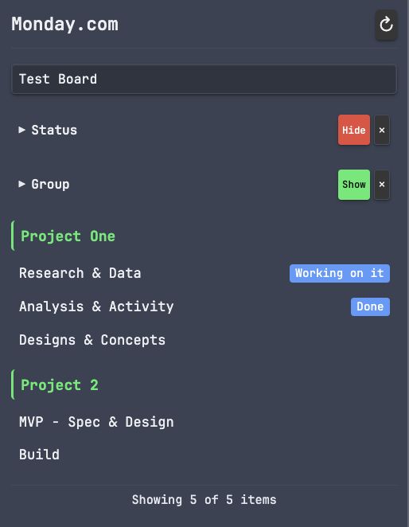
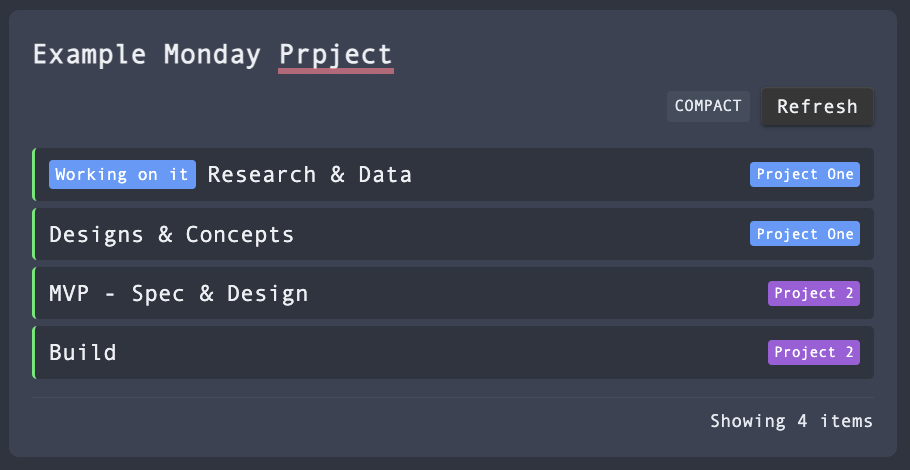
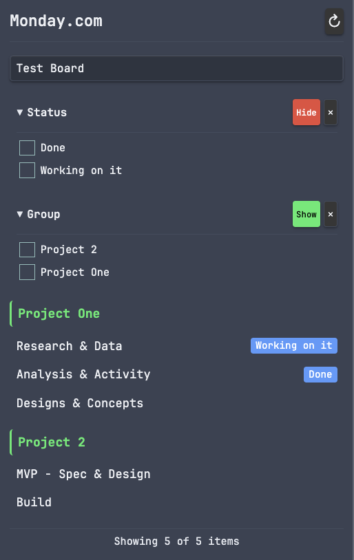
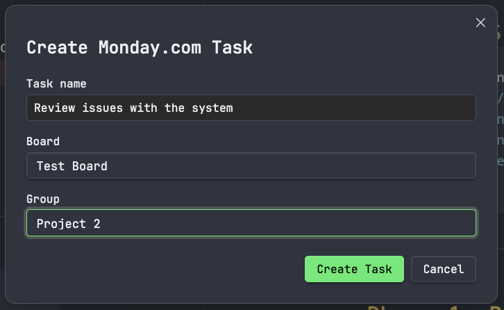

# Monday.com Integration

View your Monday.com boards and items directly within your notes and in a dedicated sidebar panel.



## Features

- **Embedded Dashboards** - Insert `monday` code blocks to display board items in your notes
- **Sidebar Panel** - Browse all your boards and items in a dedicated view
- **Click-to-Create Notes** - Click any item to create a linked note with task metadata
- **Duplicate Detection** - Checks for existing notes before creating new ones
- **Create Tasks** - Create Monday.com items from selected text in your notes
- **Change Status** - Update item status via dropdown or context menu
- **Add Comments** - Post comments to items directly from the sidebar
- **Live Data** - Fetch real-time data from Monday.com's API
- **Customisable** - Configure note folder, naming templates, and display options

## Installation

### Manual Installation

1. Download the latest release from GitHub
2. Extract to your vault's `.obsidian/plugins/monday-integration/` folder
3. Enable the plugin in Obsidian Settings > Community Plugins

### From Community Plugins (Coming Soon)

Search for "Monday.com Integration" in Settings > Community Plugins > Browse

## Setup

1. Get your Monday.com API token:
   - Go to Monday.com
   - Click your profile picture > Developers
   - Select "My Access Tokens"
   - Copy your API token

2. Configure the plugin:
   - Open Obsidian Settings > Monday.com Integration
   - Paste your API token
   - Click "Test" to verify the connection
   - Click "Load boards" to fetch your boards

## Usage

### Embed a Dashboard

Add a code block to any note:

~~~markdown
```monday
board: 1234567890
title: My Tasks
limit: 25
```
~~~




**Options:**
- `board` - Board ID (required if no default set)
- `title` - Custom title (optional)
- `limit` - Maximum items to show (default: 25)
- `columns` - Comma-separated column IDs to display

### Sidebar Panel

Click the calendar-check icon in the left ribbon or use the command palette:
- `Monday.com Integration: Open sidebar`



### Create Notes from Items

**Click any item** in the sidebar to create a linked note with task metadata. The note includes:

```yaml
---
title: "Task Name"
monday_id: "1234567890"
monday_board: "Project Board"
monday_board_id: "9876543210"
status: "Working on it"
group: "Sprint 1"
due_date: "2026-01-15"
assigned: "John Smith"
created: "2026-01-05"
tags:
  - monday
---
```

**Duplicate Detection:** If a note with the same name already exists, you'll be prompted to either open the existing note or create a new one with an incremented name.

### Create Tasks

Create Monday.com tasks directly from selected text in your notes:



### Commands

- **Insert board dashboard** - Insert a code block at cursor
- **Open sidebar** - Open the Monday.com sidebar panel
- **Refresh boards** - Force refresh cached board data
- **Create Monday.com task** - Create a task from selected text

## Configuration

Access settings via **Settings** → **Monday.com Integration**

| Setting | Description | Default |
|---------|-------------|---------|
| **API Token** | Your Monday.com API token | (required) |
| **Default Board** | Board to use when none specified | (none) |
| **Note Folder** | Folder where notes created from items are stored | `Monday` |
| **Note Name Template** | Template for naming created notes | `{name}` |
| **Show Status Bar** | Display sync status in the status bar | On |
| **Show Status Dropdown** | Show quick status dropdown on sidebar items | On |
| **Auto-Refresh** | How often to refresh data (minutes) | 5 |

### Note Name Template Placeholders

| Placeholder | Description | Example |
|-------------|-------------|---------|
| `{name}` | Item name | Fix login bug |
| `{board}` | Board name | Project Alpha |
| `{group}` | Group name | Sprint 1 |
| `{id}` | Monday.com item ID | 1234567890 |

**Example templates:**
- `{name}` → "Fix login bug.md"
- `{board}/{name}` → "Project Alpha/Fix login bug.md"
- `{group} - {name}` → "Sprint 1 - Fix login bug.md"

## Finding Your Board ID

1. Open your board in Monday.com
2. Look at the URL: `https://yourworkspace.monday.com/boards/1234567890`
3. The number after `/boards/` is your Board ID

## Support

If this plugin helps you stay organised, consider supporting its development:

[](https://buymeacoffee.com/maframpton)

## Security & Privacy

- **Local storage only** - Your API token is stored locally in your vault's plugin data folder (`data.json`)
- **No encryption at rest** - The token is stored in plain text (standard for Obsidian plugins)
- **Direct API communication** - Data is fetched directly from Monday.com's API
- **No third-party servers** - Your data is never sent anywhere except Monday.com
- **Masked input** - The token input field is masked in settings
- **No logging** - Your token is never logged or exposed

**Recommendations:**
- Use a Monday.com API token with minimal required permissions
- Do not sync your vault's `data.json` files to public repositories
- Consider adding `.obsidian/plugins/*/data.json` to your `.gitignore`

## Licence

MIT
